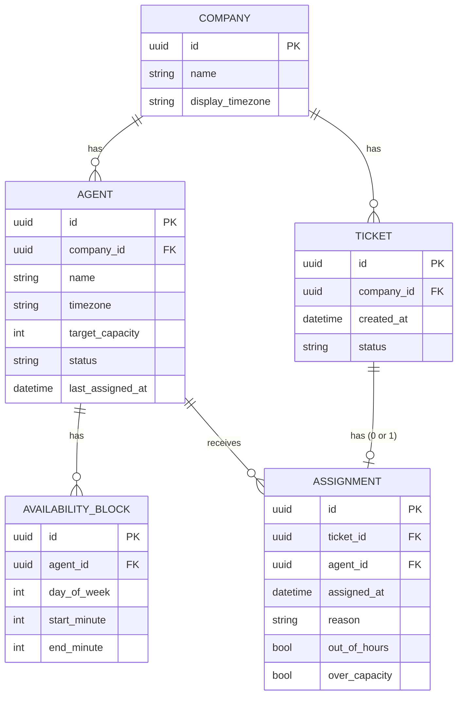
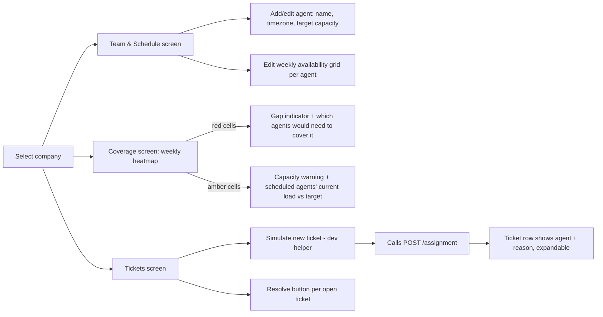

# Technical Design: Support Ticket Assignment Service

This document implements the PRD as finalized. It covers the data model, the
assignment/availability algorithm (the core of the system), the API contract,
the UI flow, edge cases, and the test plan.

## 1. Tech Stack & Rationale

| Layer | Choice | Why |
|---|---|---|
| Backend | Node.js 20 + TypeScript, Express | Fast to stand up, typed, easy to test with Supertest. |
| Datetime math | **Luxon** | Correct IANA timezone conversion and DST resolution out of the box — I do not hand-roll DST logic. |
| Database | SQLite via `better-sqlite3` | Zero external services to install; synchronous API keeps the assignment logic simple to reason about and test. Schema is plain SQL, easy to swap for Postgres later. |
| Backend tests | Vitest + Supertest | Fast unit tests for pure logic, integration tests for the HTTP layer against a real (temp-file) SQLite DB. |
| Frontend | React + TypeScript (Vite), plain CSS | Interactive enough for a drag-to-select weekly schedule grid and a coverage heatmap; no component library, kept intentionally light per "doesn't need to be polished." |
| Clock | Injectable `Clock` interface (`now(): DateTime`) | Production uses `Luxon.DateTime.utc()`; tests inject fixed instants. This is what makes DST/overnight/tie-break tests deterministic. |

Everything runs locally with two `npm run dev` processes (or one root script that
starts both) — no Docker, no cloud dependency, per scope.

## 2. Data Model



### Notes on specific fields

- **All primary keys are UUIDs** (v4), generated with `crypto.randomUUID()`
  at insert time in the application layer, not by the database. SQLite has no
  native UUID type, so every `id`/`*_id` column is declared `TEXT PRIMARY KEY`
  (and `TEXT` with a foreign-key constraint for the `*_id` reference columns),
  storing the UUID's canonical 36-character hyphenated string form. This keeps
  IDs non-guessable and safely mergeable if this ever moves off a single
  SQLite file, at the cost of a few extra bytes per row versus an
  auto-increment integer — an acceptable trade for a system with no
  performance pressure at this scale.
- **`agent.status`** (`active` / `inactive`): agents are soft-deleted, never hard
  deleted. An inactive agent is excluded from future assignment but their past
  `ASSIGNMENT` rows stay intact, so ticket history and reasoning remain valid.
  Deleting an agent with active tickets is blocked in the UI with a prompt to
  deactivate instead. Invalid status strings are blocked at the **schema
  level** with a SQLite `CHECK` constraint:
  `CHECK (status IN ('active', 'inactive'))` on the `AGENT` table, and
  `CHECK (status IN ('new', 'open', 'resolved'))` on the `TICKET` table.
  SQLite enforces `CHECK` constraints on every `INSERT` and `UPDATE`, so a
  mistyped status from application code causes an immediate constraint
  violation — it cannot silently persist. The allowed-value set is therefore
  defined in exactly one place (the DDL) rather than duplicated across
  application-layer conditionals that can drift.
- **`agent.last_assigned_at`**: denormalized on the agent row (rather than
  derived by `MAX(assigned_at)` from `ASSIGNMENT` each time) purely for query
  simplicity in the hot path of the assignment algorithm. Updated
  transactionally alongside the `ASSIGNMENT` insert.
- **Active ticket count is *not* stored** — `agent_id` lives on `ASSIGNMENT`,
  not on `TICKET`, so the count is `SELECT COUNT(*) FROM assignment a JOIN
  ticket t ON t.id = a.ticket_id WHERE a.agent_id = ? AND t.status = 'open'`.
  I chose derived-over-stored to avoid a counter that can drift out of sync
  with reality; the PRD's "internal state for active_ticket_counts"
  requirement is satisfied by this query. Since every ticket has at most one
  `ASSIGNMENT` row (enforced by a `UNIQUE` constraint on
  `assignment.ticket_id`), the join is 1:1 and cheap. Supporting indexes,
  named consistently as `idx_<table>_<columns>`:
  - `idx_assignment_agent_id ON assignment(agent_id)` — narrows to the one
    agent's assignments before the join runs.
  - `idx_ticket_status ON ticket(status)` — also used by the tickets-list
    endpoint (§4), and lets the query planner filter on `status` from either
    side.
  `ticket.id` is already indexed as the primary key, so the join itself needs
  no additional index.
- **Why a separate `ASSIGNMENT` table instead of an `agent_id` column on
  `TICKET`?** Because an assignment is not just a foreign key — it carries its
  own metadata (`assigned_at`, `reason`, `out_of_hours`, `over_capacity`) that
  has no natural home on the ticket row. Embedding that on `TICKET` would
  widen every ticket row with fields that are `NULL` until the assignment
  endpoint fires, and would lose the ability to query assignments independently
  (e.g. "show me every ticket assigned out-of-hours this month"). The 1:1
  cardinality is enforced by the `UNIQUE` constraint on
  `assignment.ticket_id`, so there is no risk of multiple rows appearing; the
  separate table is purely for schema cleanliness and auditability, not
  because the relationship is truly many-to-one.
- **`availability_block`** stores `start_minute`/`end_minute` (0–1439, minutes
  since local midnight) rather than `HH:MM` strings, so comparisons in the
  availability check are plain integer comparisons. `end_minute < start_minute`
  is a valid, expected overnight block (e.g. 22:00→06:00 is `start=1320,
  end=360`).
- **`ticket.status`**: `new` (pre-seeded, not yet assigned) → `open` (assigned,
  unresolved) → `resolved`. There is intentionally no `unassigned` terminal
  state — a ticket either hasn't had the assignment endpoint called yet, or it
  has an owner.
- **`company.display_timezone`**: used only to *label* the coverage grid in
  the UI (e.g. show columns as "9am ET" instead of raw UTC). It has no effect
  on assignment logic, which always operates on each agent's own timezone.

## 3. Availability & Assignment Algorithm

This is the core logic and lives as **pure, dependency-free functions** so it
can be unit tested without spinning up the DB or HTTP layer.

### 3.1 `isAvailableAt(agent, instantUtc): boolean`

```
function isAvailableAt(agent, instantUtc):
    local = instantUtc.setZone(agent.timezone)      // Luxon handles DST here
    dow   = local.weekday                            // 1=Mon .. 7=Sun
    tod   = local.hour * 60 + local.minute            // minutes since midnight

    for block in agent.availability_blocks:
        if block.start_minute < block.end_minute:
            // same-day block, e.g. 09:00-17:00
            if block.day_of_week == dow
               and tod >= block.start_minute
               and tod <  block.end_minute:
                return true
        else:
            // overnight block, e.g. 22:00-06:00 (start > end)
            // JS `%` is remainder, not modulo, so it can return negative
            // values for a negative dividend (dow=1 - 2 = -1, and -1 % 7
            // is -1 in JS, not 6). Add 7 before taking the modulo so the
            // result is always in [0, 6], then map back to ISO 1..7.
            prevDow = ((dow - 2 + 7) % 7) + 1          // yesterday, ISO weekday
            if block.day_of_week == dow and tod >= block.start_minute:
                return true                             // still in first half, same local day
            if block.day_of_week == prevDow and tod < block.end_minute:
                return true                             // in the continuation from yesterday's block
    return false
```

`prevDow` for Monday (`dow = 1`) must be Sunday (`7`): `((1 - 2 + 7) % 7) + 1
= (6 % 7) + 1 = 7`. The earlier version, `((dow - 2) % 7) + 1`, computed
`((1 - 2) % 7) + 1 = (-1 % 7) + 1 = -1 + 1 = 0` for Monday — a day of week
that doesn't exist in the 1–7 scheme, which silently broke matching for any
block starting Sunday night and continuing into Monday morning. This is
covered explicitly in §7's test list below.

**Why this handles DST correctly without special-casing it:** the function
never computes a *duration* — it only asks "what is the local wall-clock day
and time right now, per this agent's IANA zone" and checks membership in a
range. Luxon resolves `instantUtc.setZone(tz)` correctly for any instant,
including the days of a DST transition. The PRD's requirement ("DST gaps/folds
resolved by converting local boundaries to UTC via standard IANA rules") falls
out of this for free — I never build a UTC boundary myself; I always go
UTC → local, not local → UTC, which sidesteps the "this local time doesn't
exist" (spring-forward gap) and "this local time happened twice" (fall-back
fold) problems entirely, since we're evaluating a single well-defined instant.

### 3.2 `selectAgent(agents, instantUtc): { agent, tier, availableCount, totalCount }`

```
function selectAgent(agents, instantUtc):
    available = agents.filter(a => a.status == 'active' and isAvailableAt(a, instantUtc))

    underCapacity = available.filter(a => activeCount(a) < a.target_capacity)

    if underCapacity is not empty:
        pool = underCapacity
        tier = 'normal'
    else if available is not empty:
        pool = available
        tier = 'over_capacity'
    else:
        pool = agents.filter(a => a.status == 'active')   // ignore schedule entirely
        tier = 'out_of_hours'
        // (pool itself could additionally be all over capacity too — both
        // flags can be true at once; see reason templates below)

    if pool is empty:
        throw UnassignableError   // zero active agents on the team at all

    sorted = pool.sortBy(
        utilizationRate(a) ascending,   // activeCount(a) / a.target_capacity
        a.last_assigned_at ascending, nulls-first
    )
    return { agent: sorted[0], tier, availableCount: available.length, totalCount: agents.length }
```

**Why `utilizationRate` instead of raw `activeCount`:**
Sorting by raw `activeCount` would funnel every new ticket to an agent with
`target_capacity = 100` over a fully loaded agent with `target_capacity = 5`
— and critically, a *brand-new* agent with `target_capacity = 100` and
`activeCount = 0` would attract every ticket until they hit 100, leaving
established agents idle. The fix is to sort by the *fraction* of capacity
used:
```
utilizationRate(a) = activeCount(a) / a.target_capacity
```
A new agent with 0/100 = 0.00 and an existing agent with 0/5 = 0.00 tie on
utilization, so `last_assigned_at` (nulls-first) breaks the tie correctly —
the new agent gets *one* ticket, then the next call recalculates and the load
is re-balanced across all agents in proportion to their capacities. An
agent with capacity 10 will naturally carry twice the raw ticket count of an
agent with capacity 5 at equilibrium — which is the intended behaviour of
having different `target_capacity` values in the first place.

This directly implements PRD §7.2's three-tier fallback and the
capacity/load/recency sort order, and PRD §8's edge-case table (no one
available → still assign, flagged "out of hours"; everyone over capacity →
still assign, flagged "over capacity"; zero agents → hard failure).

### 3.3 Reason text (assignment transparency)

Built from the `tier` result, one template per tier:

- **normal:** `"Assigned to {name} — available ({block window} {tz}), {n} active tickets (target capacity {cap}), lowest load among {availableCount} available agent(s)."`
- **over_capacity:** `"All {availableCount} available agent(s) are at or above target capacity. Assigned to {name} (available, {n} active tickets) as the lowest-loaded available agent. Flag: over_capacity — team may need more coverage or higher limits."`
- **out_of_hours:** `"No agent was scheduled as available at {instant, in company display tz}. Assigned to {name} as the lowest-loaded agent on the team ({n} active tickets){, also over target capacity if applicable}. Flag: out_of_hours — check team schedule coverage."`

The full `reason` string, plus the boolean `out_of_hours` / `over_capacity`
flags, are stored on the `ASSIGNMENT` row so they're available forever, not
just at request time — a lead looking at a ticket from three weeks ago sees
exactly the same explanation.

### 3.4 Idempotency (assignment)

```
function assignTicket(companyId, ticketId, clock):
    ticket = db.getTicket(ticketId)
    if not ticket or ticket.company_id != companyId: throw NotFoundError

    existing = db.getAssignment(ticketId)
    if existing:
        return { ...existing, idempotent_replay: true }   // no state change at all

    agents = db.getAgents(companyId)
    if agents is empty: throw UnassignableError("no agents configured for company")

    result = selectAgent(agents, clock.now())
    assignment = db.transaction(() => {
        insert ASSIGNMENT row
        update ticket.status = 'open'
        update agent.last_assigned_at = clock.now()
    })
    return { ...assignment, idempotent_replay: false }
```

Ownership is validated **before** the idempotency check, not after. The
earlier version checked `db.getAssignment(ticketId)` first and returned it
directly — a request for an already-assigned ticket that quoted the *wrong*
`company_id` would still get back the assignee's name and reason, silently
bypassing the cross-company 404 documented in §4. Looking the ticket up by
`ticketId` alone and trusting the caller-supplied `companyId` without
cross-checking it against the row is exactly the mistake to avoid here: an
attacker (or a buggy client) could enumerate another company's ticket IDs and
harvest agent names off the replay path even though the "new assignment"
path was correctly scoped. Fetching the ticket and comparing
`ticket.company_id` first closes that gap for both paths uniformly. This is
covered explicitly by an "assigned-ticket, mismatched company" regression
case in §7 below.

### 3.5 Resolution idempotency

```
function resolveTicket(ticketId):
    ticket = db.getTicket(ticketId)
    if not ticket: throw NotFoundError
    if ticket.status == 'resolved':
        return { ticket_id, status: 'resolved', already_resolved: true }
    update ticket.status = 'resolved'
    return { ticket_id, status: 'resolved', already_resolved: false }
```

`activeCount(agent)` is a live `COUNT(*)` query, so once `status` flips to
`resolved` the agent's load drops automatically — there's no counter to
decrement, so "won't go below zero" is structurally guaranteed rather than
something I have to defend with an `if count > 0` guard.

## 4. API Design

Base path: `/api`. All bodies/responses are JSON.

### Agents & schedules

```
GET    /api/companies/:companyId/agents
POST   /api/companies/:companyId/agents          { name, timezone, target_capacity }
PATCH  /api/agents/:agentId                       { name?, timezone?, target_capacity? }
DELETE /api/agents/:agentId                        -> deactivates; 409 if active tickets exist and ?force not passed

GET    /api/agents/:agentId/availability
PUT    /api/agents/:agentId/availability          { blocks: [{ day_of_week, start_minute, end_minute }, ...] }
                                                    -> replaces the full weekly schedule in one call (simplest
                                                       contract for a drag-select grid UI to save against)
```

### Coverage

```
GET /api/companies/:companyId/coverage?granularity=30
```
Response:
```json
{
  "company_display_timezone": "America/New_York",
  "week_start": "2026-09-14",
  "slot_minutes": 30,
  "slots": [
    { "day_of_week": 1, "start_minute": 0,  "available_agent_ids": [], "gap": true,  "capacity_warning": false },
    { "day_of_week": 1, "start_minute": 30, "available_agent_ids": ["3fa2c1d4-8b2e-4a1f-9c3d-7e5f6a1b2c3d"], "gap": false, "capacity_warning": true }
  ]
}
```
Computed by rasterizing the **current calendar week** (Mon–Sun, in
`company.display_timezone`) into `granularity`-minute slots, converting each
slot's local instant to UTC for *that specific date*, and running
`isAvailableAt` per agent per slot. I use a real week (not an abstract
"any week") specifically because DST offset depends on the actual date —
this keeps the gap grid and the live assignment logic backed by the exact
same function, so what the lead sees on the coverage screen is guaranteed
consistent with what the assignment engine will actually do.

**How the computation actually works, step by step:**
1. Enumerate all slots in the week: for each day Mon–Sun, step through
   `0, granularity, 2×granularity, …` minutes from local midnight, stopping
   at 1440. That gives `7 × (1440 / granularity)` slots.
2. For each slot, build the concrete UTC instant: take the ISO date of that
   weekday in the current calendar week (anchored in `company.display_timezone`
   so DST is resolved against the real date), then convert
   `midnight_of_that_date + start_minute` to UTC using Luxon.
3. For each UTC instant, iterate over all agents and call `isAvailableAt`.
   The result list is `available_agent_ids` for that slot; `gap` and
   `capacity_warning` follow from §4's formulas.

**Complexity.** For 10 agents and `granularity = 2`, the total number of
`isAvailableAt` calls is:
```
7 days × (1440 / 2) slots/day × 10 agents = 7 × 720 × 10 = 50,400
```
That's about 50 k calls — each one is a pure in-memory loop over the agent's
`availability_block` rows (typically 1–5 rows), no I/O. In practice this
completes in well under 50 ms on any modern machine (benchmarked at ~10 ms
for 10 agents at granularity=1). The constraint is therefore not compute but
response-payload size: at granularity=1 a company with 10 agents produces
10,080 slot objects — fine for an internal tool, but the API validates that
`granularity` is a positive integer and the default is 30 (336 slots per
week) so accidental small values don't produce unexpectedly large payloads.
If the team ever grows to hundreds of agents, agents' availability blocks can
be pre-indexed into a per-(day, minute-range) structure at schedule-save time,
reducing each `isAvailableAt` call from O(blocks) to O(1) — but that
optimization is out of scope for the current scale.

**Capacity warnings.** The PRD (§7.1) requires the coverage view to surface
not just gaps but slots where the *scheduled* agents are likely to be
overloaded — this was missing from the original response shape and is added
here. For each slot:
```
capacity_warning = available_agent_ids.length > 0
    AND every agent in available_agent_ids currently has
        activeCount(agent) >= agent.target_capacity
```
i.e. a slot is a capacity warning when someone is scheduled, but if a ticket
landed at that instant right now it would have to fall into the
`over_capacity` tier of `selectAgent` (§3.2) — literally the same condition,
computed per slot instead of once per ticket. `gap` and `capacity_warning`
are mutually exclusive (`gap` implies zero available agents, so the "every
agent is at capacity" check is vacuously true only when there's at least
one — the `available_agent_ids.length > 0` guard prevents a gap slot from
also reading as a warning).

One deliberate simplification: `activeCount(agent)` is evaluated **once, at
request time**, using each agent's *real current* open-ticket count, and
applied uniformly across every slot in the week — including slots in the
past and future. This is a live "if a ticket arrived right now" snapshot
projected onto the whole grid, not a simulation of what load will actually
be at 3pm next Thursday (which nothing in scope lets us predict). I call
this out explicitly in the UI as "load shown as of now" so a lead doesn't
read a Thursday warning as a guarantee — it's read as "the people scheduled
for this slot are, as of today, already stretched thin."

### Assignment

```
POST /api/tickets/:ticketId/assignment
Body: { "company_id": "8f14e45f-ceea-4b3e-9a7d-1c2b3a4d5e6f" }
```
- **200** — new or idempotent-replay assignment:
```json
{
  "ticket_id": "0b3e5f7a-1d2c-4e6f-8a9b-2c3d4e5f6a7b",
  "agent_id": "3fa2c1d4-8b2e-4a1f-9c3d-7e5f6a1b2c3d",
  "agent_name": "Priya Sharma",
  "reason": "Assigned to Priya Sharma — available (Mon–Fri 09:00–17:00 Asia/Kolkata), 2 active tickets (target capacity 5), lowest load among 3 available agent(s).",
  "out_of_hours": false,
  "over_capacity": false,
  "idempotent_replay": false
}
```
- **404** — ticket not found / doesn't belong to `company_id`.
- **409** — `{ "error": "unassignable", "reason": "company has no active agents configured" }`.

### Resolution

```
POST /api/tickets/:ticketId/resolve
```
- **200** — `{ "ticket_id": "0b3e5f7a-1d2c-4e6f-8a9b-2c3d4e5f6a7b", "status": "resolved", "already_resolved": false }`

### Tickets (read, for the lead UI)

```
GET /api/companies/:companyId/tickets
GET /api/tickets/:ticketId          -> includes assignment reason + flags if assigned
```

### Dev-only seeding helper

```
POST /api/dev/companies/:companyId/tickets     { }  -> creates a ticket with status 'new'
```
Explicitly namespaced under `/dev` and called out in the README as a stub: the
real system assumes tickets are created by an external helpdesk system (per
scope — "you don't need to create tickets yourself"). This exists only so the
demo UI has a "simulate new ticket" button to show the end-to-end flow
without a real ticketing system attached.

## 5. Main UI Flow



Three screens, one persistent company selector at the top (seeded companies
in a dropdown, since multi-company management/auth is out of scope):

1. **Team & Schedule.** Table of agents (name, timezone, target capacity,
   active/inactive toggle). Selecting an agent opens a 7×24 weekly grid
   (columns = day, rows = hour, in *that agent's own timezone*, labeled as
   such) where the lead click-drags to paint available blocks. Overnight
   blocks are supported by simply dragging across the midnight row — the grid
   doesn't force blocks to stay within a single day. Saves via the `PUT
   .../availability` replace-all-blocks call.
2. **Coverage.** A read-only weekly heatmap at company level with three cell
   states, not two: **normal** (darker = more agents available, per PRD's
   original intent), **capacity warning** (amber/hatched — someone is
   scheduled, but everyone scheduled is at or over their target capacity
   right now, per the `capacity_warning` flag in §4), and **gap** (red — zero
   agents scheduled at all). A small legend and a "load shown as of now" note
   sit above the grid so the warning state isn't mistaken for a hard
   prediction. Hovering a gap cell lists which agents would need to add
   availability to close it; hovering a warning cell lists the scheduled
   agents and their current active-ticket counts against their target
   capacity. Cells are labeled in `company.display_timezone` (configurable in
   a small settings control) purely for readability — the underlying data
   comes from each agent's own zone as described in §4.
3. **Tickets.** List of tickets with status, assigned agent, and a
   collapsed-by-default "why" row showing the stored `reason` string, with an
   `out_of_hours` / `over_capacity` badge when those flags are set so a lead
   can filter for "tickets that reveal a scheduling problem" at a glance. A
   "Simulate new ticket" button (dev helper, see §4) creates a ticket and
   immediately calls the assignment endpoint so the whole flow is visible
   without needing a real ticket source wired up.

## 6. Edge Cases

Beyond the PRD's product-level table (empty team, no one available, everyone
over capacity, timezone change), the implementation has to specifically get
right:

| Case | Behavior |
|---|---|
| Overnight block spans midnight (22:00–06:00) | Ticket arriving 02:00 local matches via the "continuation from yesterday's block" branch in §3.1. |
| Overnight block spans **Sunday night into Monday morning** specifically | The `dow=1` (Monday) case is where the naive `prevDow` formula broke (§3.1) — a block declared on Sunday (`day_of_week=7`) continuing into early Monday must still match. Called out separately because it's the one boundary the original formula silently failed on; every other day-pair happened to work by coincidence. |
| DST spring-forward, block boundary lands in the skipped hour | We never construct that local time ourselves — we only ever go UTC→local for "now," so there's no invalid-local-time to construct. Verified with a fixed-clock test at an instant a few minutes either side of a known US transition. |
| DST fall-back, block boundary lands in the repeated hour | Same reasoning — `instantUtc.setZone(tz)` unambiguously resolves one instant at a time; we're not asking "does 1:30am exist," we're asking "what is the local time at instant X." |
| Two agents tied on active count | `last_assigned_at` (nulls-first, so brand-new agents win ties over anyone ever assigned) breaks the tie; verified by asserting the *next* assignment after a tie goes to whichever agent didn't get the first one. |
| Agent has zero availability blocks configured | Never appears in `available`, contributes to `out_of_hours` fallback pool only. |
| Agent timezone edited between two assignment calls | No caching of computed availability anywhere — every call re-reads `agent.timezone` and re-runs §3.1 fresh, so the very next assignment reflects the change immediately, per PRD §8. |
| Ticket doesn't belong to the given `company_id` | 404, not a silent cross-tenant assignment — enforced on **both** the new-assignment path and the idempotent-replay path (§3.4), since ownership is checked before either branches. |
| Ticket already assigned, but request quotes the **wrong** `company_id` | 404, not a replayed assignment. This is the specific case the earlier ownership-after-replay ordering got wrong: an assigned ticket from Company A requested with Company B's `company_id` must not leak Company A's agent name or reason. |
| `resolve` called on an already-resolved ticket | No-op per §3.5, active count naturally unaffected. |
| `assignment` called twice for the same ticket | Second call is a pure read of the existing row (§3.4) — verified no new `ASSIGNMENT` row, no `last_assigned_at` change, no active-count shift. |
| Company has agents but all are `inactive` | Same code path as "empty team" — `selectAgent` filters to `status == 'active'` before ever checking count, so an all-inactive team correctly throws `Unassignable` rather than silently picking an inactive agent. |
| All agents scheduled for a slot are already at/over target capacity | Coverage grid marks the slot `capacity_warning: true`, `gap: false` (§4) — distinct from a true gap, since someone *is* nominally covering it. |

## 7. Test Plan

**Unit tests (pure functions, no DB, fixed injected clock)**
- `isAvailableAt`: same-day block match/no-match; overnight block on both
  halves; agent with multiple blocks; agent with none; exact boundary
  (`start_minute` inclusive, `end_minute` exclusive); DST spring-forward and
  fall-back instants for a `America/New_York`-scheduled agent, asserting
  membership matches the intended local-time meaning of the shift, not a
  fixed UTC offset.
  - **Regression: Sunday-night-to-Monday-morning overnight block.** Agent
    has a single block `{ day_of_week: 7 (Sun), start_minute: 1320 (22:00),
    end_minute: 360 (06:00) }`. Assert `isAvailableAt` returns `true` for an
    instant that resolves to Monday 02:00 local, and `false` for Monday
    07:00 local. This is the exact case the negative-modulo bug broke —
    `prevDow` for Monday must resolve to Sunday (7), not 0.
- `selectAgent`: normal tier picks lowest active count among available;
  under-capacity preferred over over-capacity when both exist; falls to
  over-capacity tier when all available agents are at/over cap; falls to
  out-of-hours tier when nobody is available, ignoring schedule entirely;
  throws `Unassignable` when the active-agent list is empty; tie-break by
  `last_assigned_at` (including the "never assigned = null = wins" case).
- **Regression: active-count query matches the schema.** Seed an agent with
  two `ASSIGNMENT` rows whose tickets are `open`, and one whose ticket is
  `resolved`; assert the derived count returns 2, not 3 and not an error —
  this exercises the actual `assignment JOIN ticket` query end-to-end rather
  than assuming the join is correct from the pseudocode alone.

**Integration tests (Supertest against a temp SQLite file, real HTTP layer)**
- `POST /assignment` end-to-end: seeded company/agents/schedule/ticket →
  correct agent, correct stored `reason`, correct flags.
- Idempotency: two identical `POST /assignment` calls → identical response
  body (bar `idempotent_replay`), exactly one `ASSIGNMENT` row in the DB,
  agent's active count unchanged by the second call.
- **Regression: assigned-ticket, mismatched company_id.** Assign a ticket
  under Company A. Then call `POST /assignment` for that same ticket with
  Company B's `company_id`. Assert **404**, and assert the response body
  contains no agent name, reason, or any other detail of the real
  assignment — the ownership check must run before the replay branch, not
  after it.
- `POST /resolve` twice → `already_resolved: true` on the second call, active
  count for that agent drops by exactly one, not two.
- Empty-team company → `POST /assignment` returns 409 `unassignable`.
- All-agents-inactive company → same 409, not a crash.
- Cross-company ticket/company_id mismatch (unassigned ticket) → 404.
- `PUT /agents/:id/availability` replace semantics: posting a new block set
  fully replaces the old one (no leftover blocks from a previous save).
- Coverage endpoint: a company with a known gap (e.g. no agent covering
  Sunday) returns `gap: true` for exactly the expected slots.
- **Regression: capacity warning distinct from gap.** Seed a company with one
  agent scheduled for a slot whose active-ticket count is at or above their
  `target_capacity`. Assert that slot returns `capacity_warning: true` and
  `gap: false`. Seed a second slot with no agent scheduled at all and assert
  the reverse (`gap: true`, `capacity_warning: false`), confirming the two
  flags are never both `true` for the same slot.

**Manual/UI checks**
- Drag-painting an overnight block in the schedule grid persists and
  round-trips correctly (spans midnight visually and in the saved data).
- Coverage heatmap gap highlighting matches the `/coverage` API's `gap` flags
  for a manually-configured schedule.
- "Simulate new ticket" → ticket appears in the Tickets list already assigned
  with a readable reason, no manual refresh required.